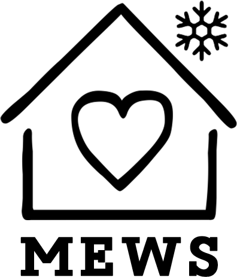

# Montavilla Emergency Warming Shelter

MEWS (Montavilla Emergency Warming Shelter) is a temporary shelter in Portland,
Oregon.

MEWS is a queer/trans organized, low barrier shelter rooted in anti-racist,
trauma informed, and harm reduction approaches to community care and mutual aid.

---

This website was built with plain HTML, CSS, and JavaScript and is deployed and
hosted with GitHub Pages.

The goal is a clean, simple, speedy website that foregrounds important
information and actions for volunteers, guests, and other folks interested in
the shelter.
